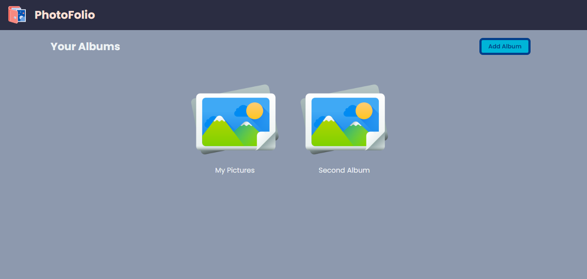
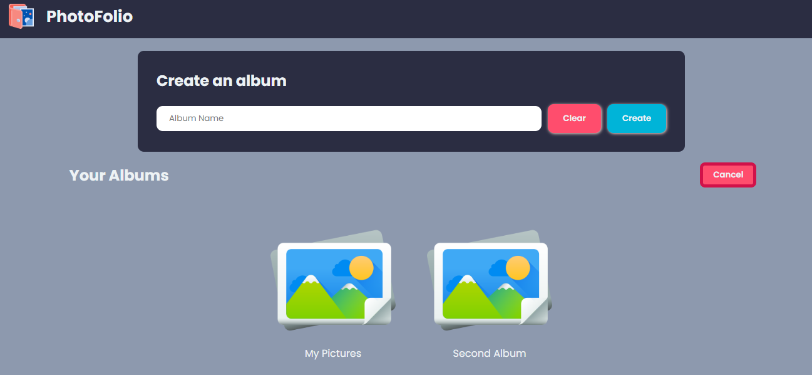
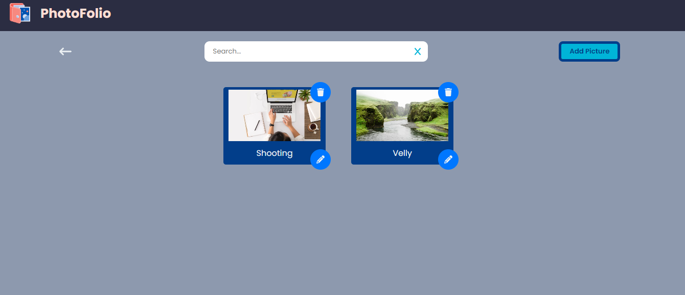
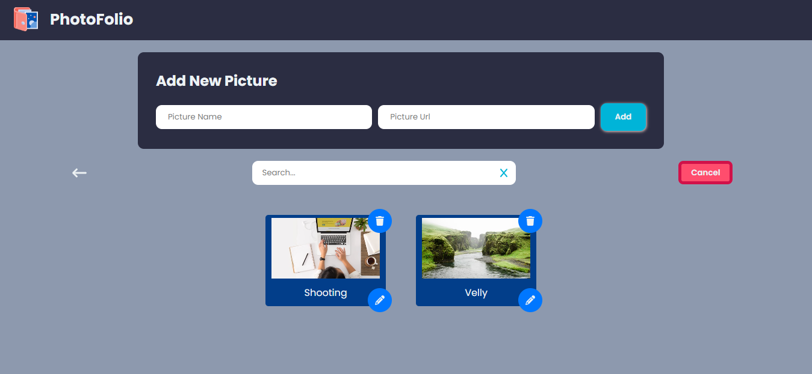
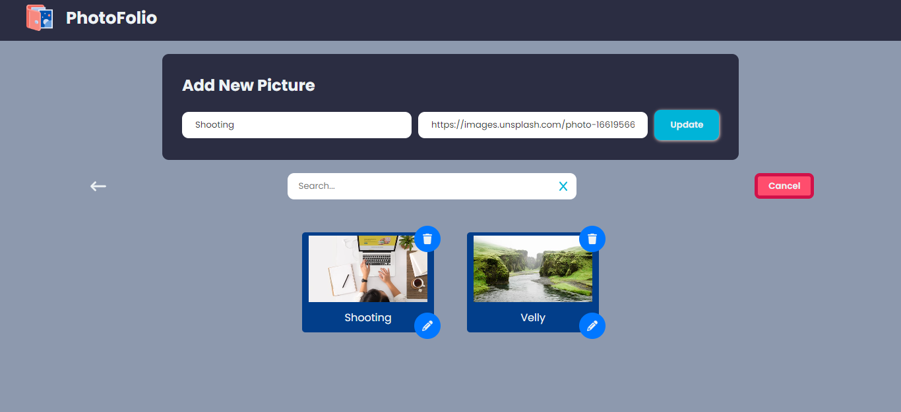

# PhotoFolio

PhotoFolio is a web application for managing and organizing photo albums. Users can create albums, add pictures to albums, and view their photo collection in a user-friendly interface.

## Features

- Create new albums and add pictures to them.
- View albums and browse through the pictures in a slideshow-like carousal.
- Edit or delete pictures within an album.
- Search for specific pictures within an album.
- Download pictures or copy their URLs for sharing.

## Installation

To run the PhotoFolio project locally, follow these steps:

1. Clone the repository: `git clone https://github.com/DeepakKumarVermaRamgarh/Photofolio-app`
2. Navigate to the project directory: `cd photofolio`
3. Install dependencies: `npm install`
4. Set up Firebase Firestore: Follow the Firebase documentation to create a project and obtain the necessary credentials.
5. Create a `FireBaseInIt.js` file in the project root directory and export the Firebase configuration.
6. Start the development server: `npm start`
7. Open your browser and visit `http://localhost:3000` to view the application.

    
## Usage

- Create a new album by clicking the "Add Album" button on the Album List page.
- Click on an album to view its pictures.
- To add a picture to an album, click on the "Add Picture" button and fill in the picture details.
- Click on a picture to view it in a slideshow-like carousal.
- Use the arrow buttons to navigate between pictures.
- To edit or delete a picture, click on the respective icons below the picture.
- Use the search box to filter pictures within an album.
## Tech Stack

- **React**: JavaScript library for building user interfaces.
- **Firebase Firestore**: Cloud-hosted NoSQL database for storing albums and pictures.
- **React Icons**: Library of customizable SVG icons for React.
- **React Toastify**: Notification library for displaying success, error, and information messages.

## Authors

This project was created by Deepak Kumar Verma.
- [@DeepakKumarVermaRamgarh](https://github.com/DeepakKumarVermaRamgarh/)

## Contributing

Contributions to PhotoFolio are welcome! If you find any bugs or have suggestions for improvements, please submit an issue or a pull request.

## Screenshots

